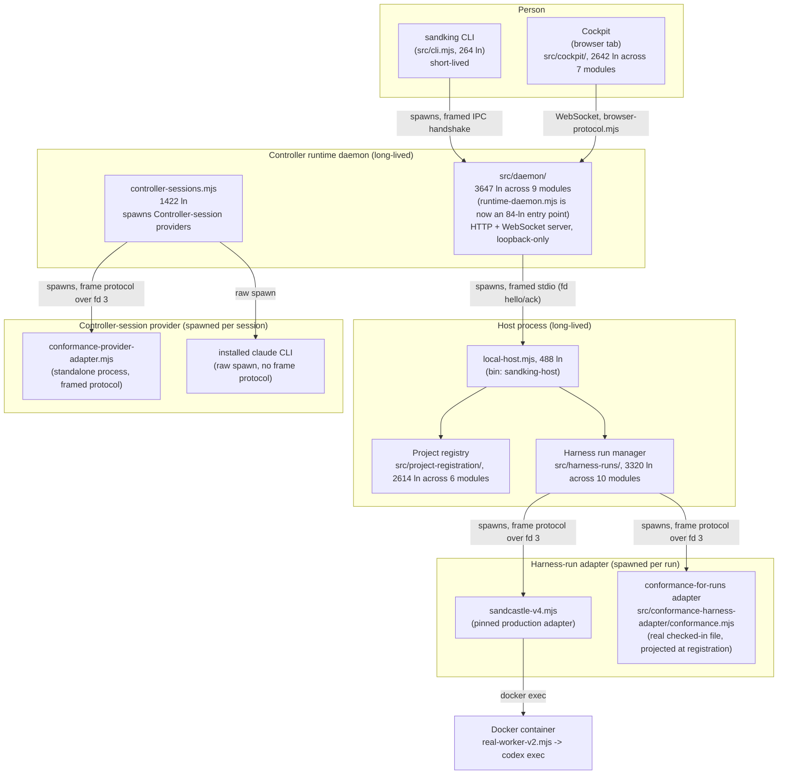

# Sand-King architecture

A human-facing map of how Sand-King is actually built, as of the end of slice 3
(issue #169, 2026-08-11), with structural references refreshed 2026-08-15
after parent issue #207 closed. This documents structure and process topology, not
vocabulary — for term definitions (Controller, Cockpit, Host, Project, Harness,
Worker, etc.) see the canonical glossary in `../CONTEXT.md`. `docs/agents/` is
a separate, agent-consumed set of skill docs — this folder is for people.

This snapshot will go stale as the code changes. Treat it as "how it worked
when written," not a living spec — re-verify against the code before relying
on a specific claim for something consequential.

Scale for context: `src/` is ~28,500 lines across ~75 files; `.sandcastle/`
(the separate build tooling used to develop Sand-King itself) is ~3,500 lines.

## Process topology

Sand-King runs as three long/short-lived OS processes plus adapter/provider
processes spawned on demand:



| Process | Entry point | Lines | Lifetime | Owns |
|---|---|---|---|---|
| CLI | `src/cli.mjs` | 264 | one-shot | argv parsing, hands off to runtime |
| Controller runtime daemon | `src/daemon/` (entry: `src/runtime-daemon.mjs`, now an 84-ln arg-parsing shim over `src/daemon/index.mjs`) | 3647 across 9 modules | until stopped | HTTP+WS server, Cockpit static assets, Controller sessions |
| Host | `src/local-host.mjs` (bin `sandking-host`) | 488 | until stopped | Project registry, Harness run manager |

The daemon spawns the Host with a **hand-built minimal environment**
(`daemon/host-transport/local.mjs`, `launchHost`, ~line 180) — Controller-side env vars, provider
credentials, and `NODE_OPTIONS` are explicitly excluded, not merely unset.

Startup is a two-phase handshake: the CLI spawns the daemon detached, polls a
state file until ready, then sends an explicit `runtime.start.commit` and
waits for `runtime.start.committed` before disconnecting
(`runtime.mjs:717-805`). The daemon↔Host link negotiates protocol version,
capabilities, and a schema digest before accepting any identity/mutation
frames.

## The three wire protocols

Sand-King has three distinct framed protocols, not one:

1. **Daemon ↔ Host** — framed stdio (`writeFrame`/`readFrame`), hello/ack
   handshake with capability negotiation.
2. **Browser ↔ Daemon** — a versioned, `zod`-typed WebSocket protocol
   (`src/browser-protocol.mjs`, 512 ln). Message families: `browser.hello`
   handshake, `browser.terminal.attach/resize` (PTY streaming — terminal bytes
   are opaque payload inside this typed channel), `browser.harness-run.*`
   (observe/launch/cancel/recover/logs.get), and `runtime.connection-state`
   for staleness signaling per area (project prep, harness-run observation,
   planning spine, controller sessions).
3. **Host ↔ adapter process** — a framed protocol over **file descriptor 3**
   (`src/harness-adapter-protocol.mjs`): readiness envelope → zero or more
   progress envelopes → **exactly one** terminal envelope. Process exit code
   and stdout/stderr text are never inspected for success or failure — only a
   well-formed terminal envelope counts. This same protocol shape is used by
   both Harness-run adapters and Controller-session adapters (see below) —
   they share a schema family but are invoked from different places for
   different purposes.

## Launch flow (project registration → real Harness run)

```mermaid
sequenceDiagram
    participant P as Person
    participant C as Cockpit (browser)
    participant D as Daemon
    participant H as Host
    participant A as Harness adapter process
    participant W as Docker / real-worker-v2.mjs

    P->>C: enter Project path, pick Harness (conformance | production)
    C->>D: WS mutation (open-project)
    D->>H: framed request
    H->>H: canonical path-anchored Project identity<br/>(tolerates non-git paths)
    alt conformance Harness
        H->>H: initializeConformanceWorkspace<br/>(Host-private git workspace, generated in-process)
    else production Harness
        H->>H: initializeProductionHarnessWorkspace<br/>(project-harness-seed.mjs: project the pinned<br/>.sandcastle/ seed, verify integrity hashes)
    end
    H->>H: pin exact commit (git rev-parse HEAD)
    H-->>C: Project + Harness ready
    P->>C: click Launch (Yes/No confirm)
    C->>D: WS mutation (launch-harness)
    D->>H: framed request
    H->>H: prepareProductionHarness — re-verify pinned<br/>commit bytes match seed (separate from registration check)
    Note over H: production Harness only:<br/>projects pinned files into<br/>&lt;project&gt;/.sandking/harnesses/&lt;id&gt;/<br/>(git-invisible via .git/info/exclude,<br/>see below)
    H->>A: spawn adapter, invokePinnedHarnessAdapter<br/>(frame protocol over fd 3)
    A-->>H: readiness envelope
    A->>W: (production only) docker exec, real-worker-v2.mjs
    W->>W: codex exec with pinned-skill prompt
    A-->>H: progress envelopes
    A-->>H: exactly one terminal envelope
    H-->>C: ordered lifecycle events (WS)
    C->>D: fetch log ranges on demand
```

### The project-local `.sandking/` projection (production Harness only)

**Correction to an earlier version of this doc**: the target Project directory
is not left untouched for the production Harness path. `prepareProductionHarness`
(`production-harness-preparation.mjs:631`) runs on **every launch attempt** and
projects the pinned Harness's worker environment, adapter, and skills into
`<projectRoot>/.sandking/harnesses/<harnessId>/` — inside the Project itself.
This file was not touched by the #207 decomposition and remains a single
~1,037-line module.

Why: the Docker sandbox that runs the real Worker is launched with
`cwd: projectPath` (`real-worker-v2.mjs:189`) — `@ai-hero/sandcastle`'s docker
sandbox provider mounts the Project's working tree as the container's
filesystem. Staging the projection inside the Project directory lets it be
integrity-verified and proven collision-free against your real tracked files,
on the same filesystem the sandbox will use, without a second bind mount.

It's kept git-invisible on purpose: the code appends rules to
`.git/info/exclude` (the local, untracked exclude file — not your committed
`.gitignore`) and explicitly diffs `git status`/`git ls-files` before and
after to guarantee the projection never perturbs real Project content. This
requires the Project to be a real git repository **at its own root**
(`git rev-parse --show-toplevel` must equal the Project path) — a requirement
specific to the production Harness path, not to registration or the
conformance Harness.

**It is not cleaned up on success.** The only removal call
(`production-harness-preparation.mjs:1011`) fires exclusively on a failed/
rolled-back preparation. After a successful run, `.sandking/harnesses/<id>/`
simply persists in the Project directory indefinitely.

At actual launch time, a **third** copy is made: `materializeProductionHarnessExecutionSnapshot`
(defined at `production-harness-preparation.mjs:330`, invoked from
`harness-runs/operations/launch.mjs`) copies that project-local
projection into a Host-private, per-run "execution snapshot"
(`~/.sandking/.../harness-runs/<run-id>/execution/`), which is what
`real-worker-v2.mjs` actually reads to build the Codex prompt before the
container starts. So one production Harness run involves three copies of
essentially the same pinned bytes: the registered Harness workspace
(`~/.sandking`), the project-local staged projection
(`<project>/.sandking/harnesses/<id>/`), and the per-run execution snapshot
(`~/.sandking/.../harness-runs/<id>/execution/`). See `docs/current-state.md`
for this as a loose-end item.

## Data/state boundaries

- **Host-private state** (`~/.sandking` by default): runtime lifecycle
  revision, launch/stop lock, Controller↔Host identity binding, bootstrap
  claims, audit records, Project registry, Harness workspaces (each its own
  git repo), Harness run state/logs, and (production Harness only) a
  per-run execution snapshot.
- **Project directory**: untouched by the **conformance** Harness path and by
  registration in general. The **production** Harness path writes a
  persistent, git-invisible `.sandking/harnesses/<harnessId>/` projection into
  the Project on every launch — see above. Beyond that, only touched if a
  Harness run's Worker itself commits to it (that's the whole point of a run).
- **Harness workspace**: a separate, Host-private git repo per registered
  Harness, pinned to an exact commit. For the production Harness, this is a
  verified-integrity projection of the bundled seed (see below) — not a live
  symlink or copy of your local `.sandcastle/`.

## The provider-invocation landscape (three mechanisms, not one)

There is no single "how does Sand-King talk to a provider" abstraction —
three genuinely different mechanisms exist side by side:

| Mechanism | Used for | Protocol | Code |
|---|---|---|---|
| Framed Harness-run adapter | Harness runs (conformance or production) | fd-3 frame protocol | `harness-adapter-protocol.mjs`, `sandcastle-v4.mjs` |
| Framed Controller-session adapter | Conformance Controller sessions | same fd-3 frame protocol, different `adapterId` | `conformance-provider-adapter.mjs` (standalone process) |
| Raw CLI probe + spawn | Installed Claude Code Controller sessions | none — direct process spawn | `claude-provider-adapter.mjs` (plain library, not a spawned adapter) |

Two different things are both informally "the conformance adapter": the
standalone `conformance-provider-adapter.mjs` process (Controller sessions,
`adapterId: "conformance-controller-adapter-v1"`) and
`src/conformance-harness-adapter/conformance.mjs` (Harness runs, `adapterId:
"conformance-harness-adapter-v1"`). Same protocol family, different code,
easy to conflate by name alone — this is exactly the kind of confusion that
produced back-and-forth corrections earlier in this project's own review
process. When in doubt, check which one a given piece of code actually
spawns.

**Update (post-#207):** the Harness-run conformance adapter is no longer an
inline template string embedded in `project-registration.mjs`. It's now a
real, checked-in file (`src/conformance-harness-adapter/conformance.mjs`, 234
ln), referenced by path from `src/project-registration/state.mjs:24` and
projected into the workspace the same way the production seed is — exactly
the change `docs/target-structure.md` proposed. It has **not**, however, been
relocated out of `src/` into `test/fixtures/` as that doc also proposed; it
still ships as part of the product tree, and the Cockpit's Harness dropdown
still offers it as a selectable option (`permittedTestDouble` is still a live
field in `src/project-registration/schemas.mjs`).

## The adapter version landscape

`src/production-sandcastle-adapter/` contains four numbered adapter versions.
Only one is live:

| File | Live in runtime code? | Status |
|---|---|---|
| `sandcastle-v1.mjs` / `v2.mjs` / `v3.mjs` | No | Dead code, deliberately excluded from the shipped package (`.npmignore`), retained only so a boundary test can assert-by-path they never ship |
| `real-worker.mjs` | Only imported by dead v2/v3 | Dead |
| `sandcastle-v4.mjs` (lines 1–~260: framing/arg-parsing/gate) | Yes — this is the pinned production adapter | Live |
| `sandcastle-v4.mjs` (lines ~260–708: dispatch past the gate) | **Correction**: no — gated behind a manifest only tests create, see below | Test-reachable only |
| `real-worker-v2.mjs` | **Correction**: no, same gate | Test-reachable only |
| `controlled-worker-fixture.mjs` | **Correction**: no — previously listed here as "Live," but it has the identical unconditional dependency on the same missing manifest (`controlled-worker-fixture.mjs:9`), no fallback | Test-reachable only |

**What the adapter would do if it were reachable:** `sandcastle-v4.mjs` →
`real-worker-v2.mjs` runs a real `openai-codex` provider inside Docker with
the Worker's pinned skill inventory — but the prompt is a **fixed canary
task** (`.sandcastle/real-delegation-prompt.md`: create one file, commit it,
nothing else) that explicitly instructs the model not to perform the other
three pinned skills' workflows (`sandking.issue-implementation`,
`sandking.issue-planning`, `sandking.pull-request-review`). The full
`.sandcastle` toolkit — `main.mts` and its real GitHub-issue-driven
plan→implement→review loop — is bundled into the production seed
(`seed-manifest.json`) and integrity-verified, but **no code path in `src/`
ever executes it.** It rides along, fully capable, permanently dormant.

**More fundamentally: none of this is reachable through the shipped product
today — in either mode.** `inspectRuntime()` (`sandcastle-v4.mjs:263`) gates
everything past it on a `sandcastle.worker-fixture.json` or
`sandcastle.real-provider.json` manifest existing in the Project root — and
the only code anywhere that writes either file is `test/*.test.mjs` fixture
setup. This blocks not just the real-provider branch but also
`controlled-worker-fixture.mjs`'s own test-double branch (it has the same
unconditional read, no fallback) — so the entire production-adapter payload,
real and fixture alike, is unreachable. No `src/` code path (not
`production-harness-preparation.mjs`, not `harness-runs.mjs`, not the
Cockpit) ever creates either manifest. A real Cockpit launch of the
production Harness fails closed with `harness_worker_provider_unavailable`
on every Project, regardless of Docker/Codex configuration — confirmed by
reproducing this exact error from a real launch. See `docs/current-state.md`
gap #2 and `docs/code-inventory.md` for the full quantitative breakdown
and severity.

## Cross-platform process supervision

Reliably killing an owned process tree (so a killed Controller/Host tears down
everything it started) is handled with three structurally different
approaches, one per OS — real OS differences plausibly justify this, but it's
worth being explicit that there's no shared interface tying them together:

| OS | Files | Approach |
|---|---|---|
| Linux | `posix-process-tree.mjs` (979 ln) + `posix-process-tree-helper.c` (491 ln, compiled to prebuilt binaries in `src/native/{linux-x64,linux-arm64}/`) | Native C helper binary |
| macOS | `darwin-process-tree.mjs` (931 ln) + `darwin-process-containment.cjs` (67 ln) | Pure JS, self-contained |
| Windows | `windows-process-tree.mjs` (1262 ln, the largest of the three) + `windows-process-barrier.cjs` (46 ln) | Pure JS |

All three feed into `host-loss-termination-evidence.mjs` (115 ln), a shared
evidence-recording helper used when a Host is lost mid-run. See
`docs/current-state.md` for a concrete risk in the Linux native-binary build
process.

## Planning journey — removed

**Update (post-#207):** `src/planning-spine.mjs` no longer exists. The
fixture-only Planning journey this section used to describe — schema-locked
to `^github:fixture:issue:[0-9]+$`, with no dormant real-GitHub path — was
deleted outright rather than connected to live GitHub data (commit `bce19ce`,
"remove fixture Planning journey (PRD #207)"). There is no remaining
reference to `planning-spine` or `renderPlanning` anywhere in `src/`, and the
Cockpit's product navigation no longer has a Planning destination (see the
next section). Wiring a real GitHub issue graph, if wanted, is now a
from-scratch addition, not a matter of reconnecting something dormant. See
`docs/current-state.md`.

## A naming note: "Workbench"

`renderWorkbench` in `src/cockpit/chrome.mjs` (moved from the old `cockpit.js`
by the #207 split) is not a fourth product concept alongside
Controller/Cockpit/Host/Harness — it's the name of the function that renders
the page chrome (sidebar navigation) around the real sections (project
preparation, harness-run view). Don't read it as CONTEXT.md-level
vocabulary.
